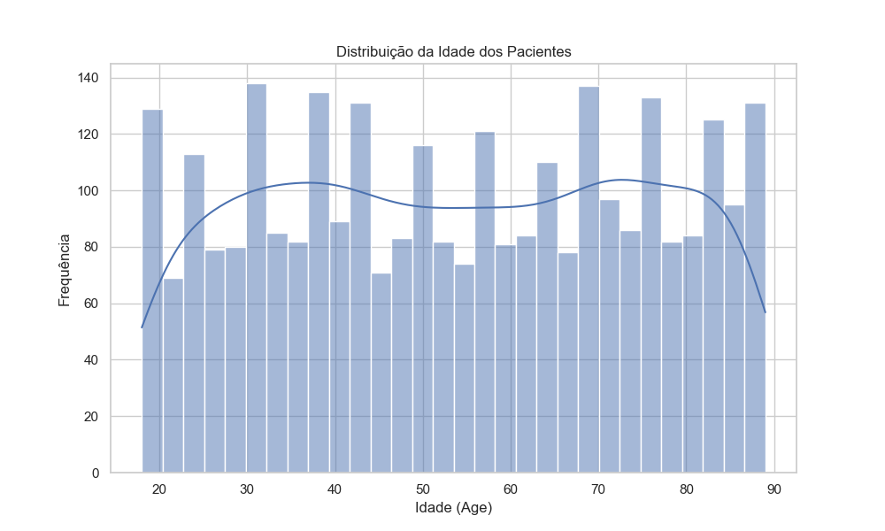
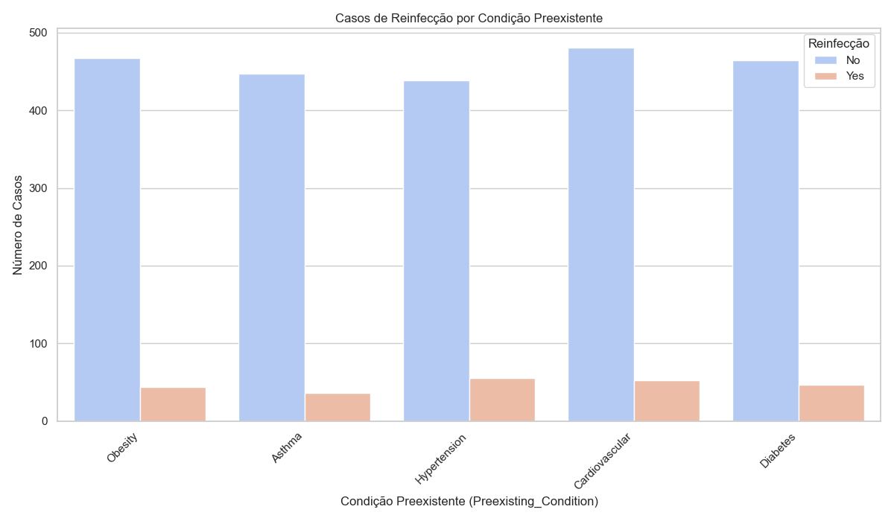

# 📊 Análise de Dados de COVID-19 Relacionados a Doenças e Reinfecção

## Visão Geral do Projeto

Este projeto consiste na análise de dados relacionados à COVID-19, com foco em potenciais padrões e insights sobre **doenças relacionadas e reinfecção**. O objetivo é explorar o dataset `covid_related_disease_data.csv` para identificar tendências, distribuições e correlações que possam contribuir para um melhor entendimento da doença e seus impactos em diferentes perfis de pacientes.

## 🎯 Objetivos da Análise

* **Compreender a Estrutura dos Dados:** Realizar uma exploração inicial para entender as colunas, tipos de dados e presença de valores ausentes.
* **Limpeza e Pré-processamento:** Tratar inconsistências, valores nulos e formatar os dados para análise.
* **Análise Descritiva:** Calcular estatísticas sumárias e explorar a distribuição das variáveis chave.
* **Identificar Padrões e Tendências:** Investigar relações entre diferentes variáveis (ex: idade vs. severidade, condições preexistentes vs. reinfecção).
* **Visualização de Dados:** Criar gráficos informativos para comunicar os principais insights de forma clara e visual.

## 📁 Estrutura do Repositório

├── dados/

│   └── covid_related_disease_data.csv    # Dataset original

├── imagens/

│   ├── contagem_genero.png               # Gráfico de Contagem por Gênero

│   ├── distribuicao_idade.png            # Gráfico de Distribuição da Idade (incorporado abaixo)

│   ├── heatmap_correlacao.png            # Mapa de Calor da Matriz de Correlação

│   ├── reinf_por_condicao_preexistente.png # Gráfico de Reinfecção por Condição Preexistente (incorporado abaixo)

│   └── ...                               # Outros gráficos gerados

├── notebook/

│   └── analise_covid_reinfection.ipynb   # Jupyter Notebook com a análise completa

└── README.md                             # Este arquivo

## 🛠️ Tecnologias e Bibliotecas Utilizadas

* **Python 3.x**
* **Pandas:** Para manipulação e análise de dados.
* **NumPy:** Para operações numéricas (usado indiretamente pelo Pandas).
* **Matplotlib:** Para criação de gráficos estáticos.
* **Seaborn:** Para visualizações estatísticas atraentes.
* **Jupyter Notebook:** Ambiente interativo para desenvolvimento e apresentação.

## 🚀 Como Executar a Análise

Para replicar esta análise em seu ambiente, siga os passos abaixo:

1.  **Clone ou Baixe o Repositório:** Obtenha os arquivos do projeto.
    *(Se você estiver usando Git: `git clone https://github.com/seu-usuario/seu-repositorio.git` e `cd seu-repositorio`)*

2.  **Crie e Ative um Ambiente Virtual (Opcional, mas Recomendado):**
    ```bash
    python -m venv venv
    # No Windows:
    venv\Scripts\activate
    # No macOS/Linux:
    source venv/bin/activate
    ```

3.  **Instale as Dependências:**
    ```bash
    pip install pandas numpy matplotlib seaborn jupyter
    ```

4.  **Inicie o Jupyter Notebook:**
    Navegue até a pasta `notebook/` e inicie o Jupyter:
    ```bash
    cd notebook
    jupyter notebook
    ```

5.  **Execute o Notebook:**
    No navegador, abra `analise_covid_reinfection.ipynb` e execute todas as células para ver a análise completa e replicar os gráficos.

## 📊 Resultados e Insights Chave

A análise do dataset `covid_related_disease_data.csv` revelou os seguintes insights:

* **Distribuição Etária:** A análise da distribuição de idade dos pacientes revelou que a maioria dos casos se concentra na faixa etária entre **40 e 60 anos**, indicando que este grupo etário é o mais prevalente no dataset.

    

* **Contagem por Gênero:** Em relação à distribuição por gênero, observou-se uma leve predominância de casos no **sexo feminino**, com uma diferença de aproximadamente 100 pacientes em relação ao sexo masculino.

* **Reinfecção e Condições Preexistentes:** Para a maioria das condições preexistentes analisadas, os dados indicam que a maior parte dos casos **não é de reinfecção**. Embora pacientes com **problemas cardiovasculares** representem um dos maiores grupos no dataset, a proporção de reinfectados para essa condição é consistente com a de outras condições.

    

* **Correlação entre Variáveis Numéricas:** O mapa de calor da matriz de correlação indicou que, para as variáveis numéricas presentes no dataset, **não há correlações lineares fortes ou significativas**. A maioria dos coeficientes de correlação está próxima de 0.0, sugerindo que o aumento ou diminuição de uma variável numérica não impacta diretamente outra de forma linear.

## 💡 Próximos Passos e Melhorias Futuras

* **Análise Aprofundada de Colunas Categóricas:** Explorar em mais detalhes as relações entre `COVID_Strain`, `Vaccination_Status`, `Vaccine_Type` e `Long_COVID_Symptoms` com a severidade ou reinfecção.
* **Análise Temporal Detalhada:** Se possível, investigar padrões diários/semanais/mensais de infecção e reinfecção utilizando as colunas de data (`Date_of_Infection`, `Date_of_Reinfection`) para identificar tendências ou sazonalidades.
* **Modelagem Preditiva:** Desenvolver um modelo (ex: classificação) para prever a severidade da doença ou o risco de reinfecção com base nas características dos pacientes.
* **Tratamento de Missing Values Avançado:** Investigar métodos mais sofisticados de imputação para lidar com valores ausentes.

## 🤝 Contribuição

Contribuições são bem-vindas! Se você tiver sugestões de melhorias, detetar problemas ou quiser adicionar novas análises, sinta-se à vontade para abrir "issues" ou "pull requests".

